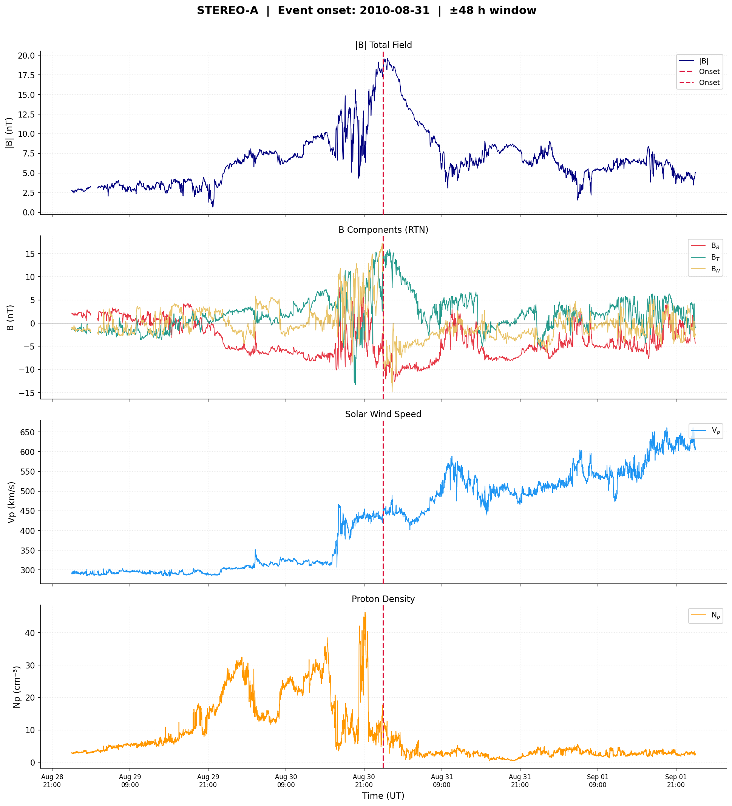
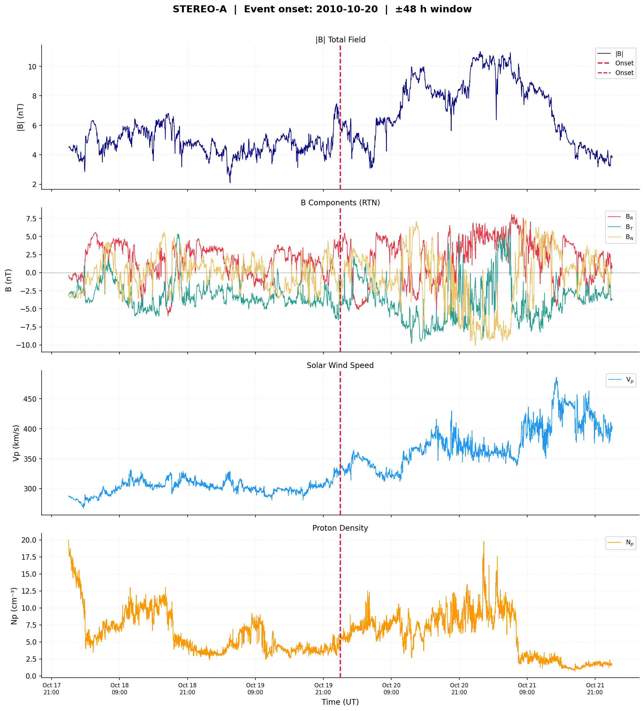
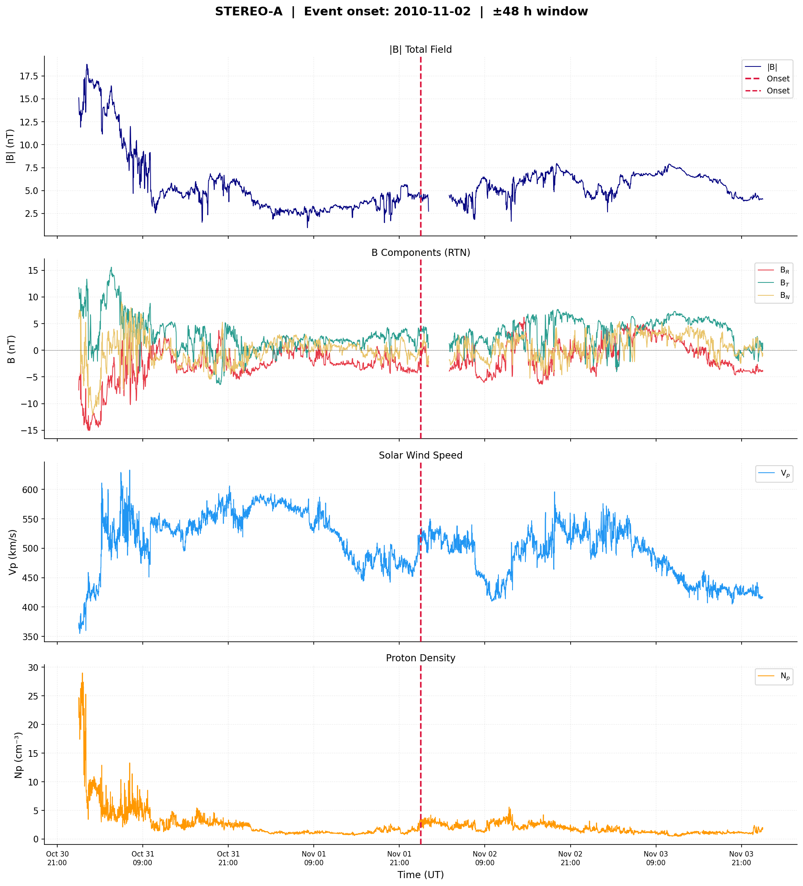
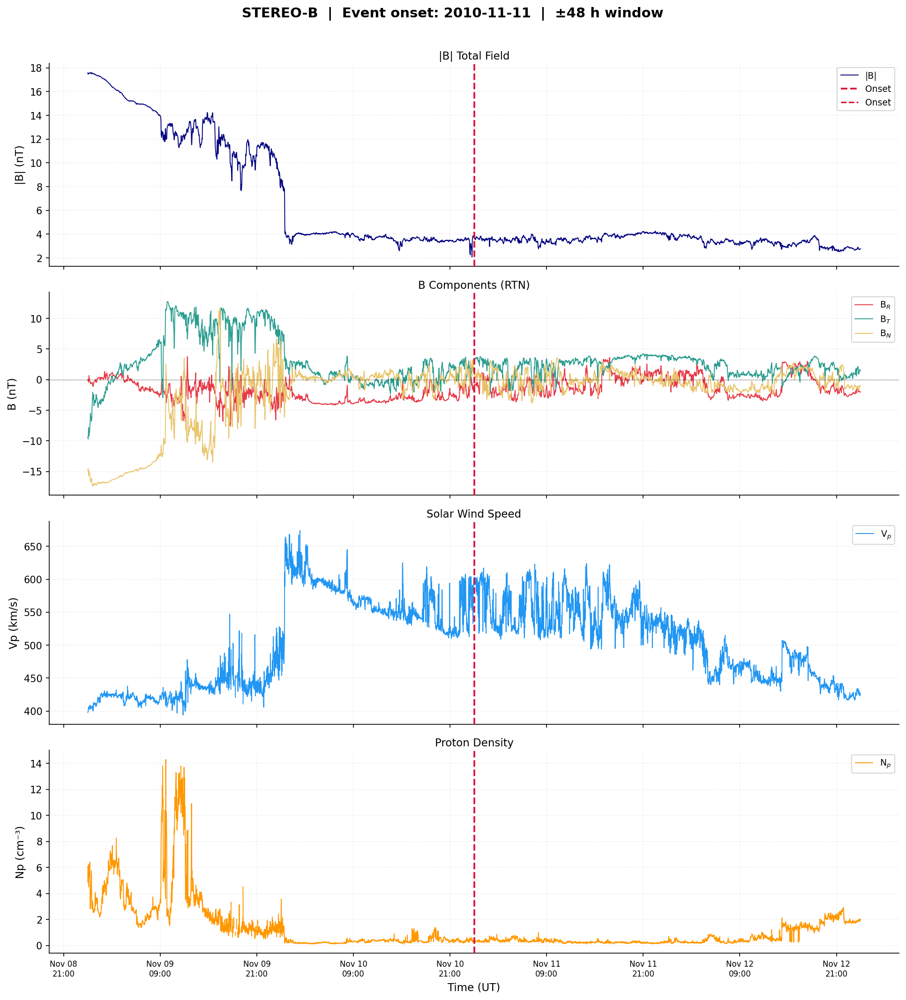
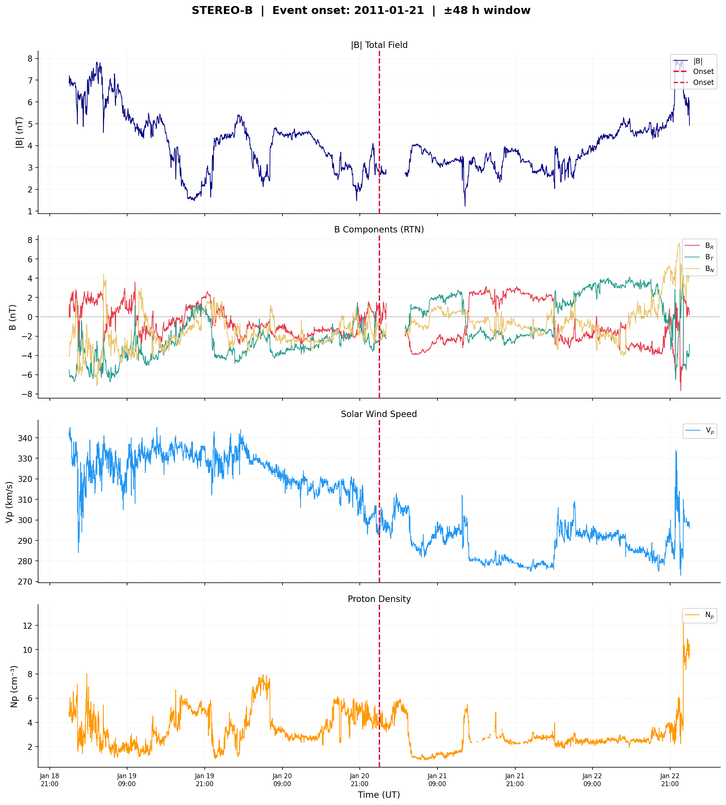

# Results From Rites: SEP Event Driver Analysis

## Research Question

The working question is: why do Solar Energetic Particles (SEPs) accelerate, and what variables in the STEREO event data are correlated with that acceleration environment?

The local CSV data are plasma and magnetic-field context around five STEREO events. They include magnetic-field magnitude, magnetic-field components, solar-wind proton speed, proton density, temperature, beta, entropy, pressure, and related quantities depending on spacecraft/event.

Important limitation: these files do not contain direct SEP particle flux or intensity profiles. That means this analysis can identify the solar-wind and magnetic-field conditions that are consistent with SEP acceleration, but it cannot prove the acceleration mechanism by itself.

## Main Result

The clearest pattern in the available CSVs is disturbed and compressed solar-wind structure near the events. The strongest signatures are:

- enhanced magnetic-field magnitude (`BTOTAL`)
- solar-wind speed changes (`Vp`) and sharp hourly speed jumps
- proton density (`Np`) and pressure changes
- strong correlation between magnetic field and total pressure
- temperature/entropy changes that track solar-wind structure
- low-beta or changing-beta intervals where magnetic pressure becomes dynamically important

This is consistent with SEP acceleration by CME-driven shocks or compressed/disturbed magnetic structures. In physical terms, SEPs are not accelerated just because the solar wind is fast. They accelerate when shocks, compression regions, turbulence, and magnetic connectivity let particles scatter repeatedly and gain energy.

## What The Data Suggests About "Why"

The most defensible answer from this repo is:

SEP acceleration is most likely associated with shock/compression conditions in the solar wind. These conditions strengthen the magnetic field, increase pressure, disturb the plasma, and create scattering environments where particles can repeatedly gain energy.

The data supports this interpretation because magnetic-field strength and pressure are strongly correlated, and several events show post-onset increases in magnetic field, solar-wind speed, density, pressure, or temperature.

## Strongest Correlations

Spearman correlations were computed across the pooled event windows using the common variables available across STEREO-A and STEREO-B.

| Variable 1 | Variable 2 | Spearman rho |
|---|---:|---:|
| `Tp` | `Entropy` | 0.890 |
| `BTOTAL` | `Total_Pressure` | 0.841 |
| `Vp` | `Entropy` | 0.832 |
| `Vp` | `Tp` | 0.824 |
| `Np` | `Entropy` | -0.762 |
| `Np` | `Total_Pressure` | 0.708 |
| `Np` | `Beta` | 0.631 |
| `Vp` | `Np` | -0.554 |
| `Beta` | `Entropy` | -0.545 |
| `Np` | `Tp` | -0.439 |
| `Vp` | `Beta` | -0.424 |
| `BTOTAL` | `Beta` | -0.387 |

For the STEREO-A events, the CSVs contain additional pressure and magnetic-field component variables. The strongest extended correlations were:

| Variable 1 | Variable 2 | Spearman rho |
|---|---:|---:|
| `BTOTAL` | `Magnetic_Pressure` | 1.000 |
| `Tp` | `Entropy` | 0.902 |
| `Vp` | `Tp` | 0.816 |
| `Total_Pressure` | `Magnetic_Pressure` | 0.809 |
| `BTOTAL` | `Total_Pressure` | 0.809 |
| `Vp` | `Entropy` | 0.808 |
| `Magnetic_Pressure` | `B_component_sigma` | 0.802 |
| `BTOTAL` | `B_component_sigma` | 0.802 |
| `Np` | `Dynamic_Pressure` | 0.786 |
| `Total_Pressure` | `Dynamic_Pressure` | 0.764 |
| `Np` | `Entropy` | -0.758 |
| `Total_Pressure` | `B_component_sigma` | 0.689 |

## Event-Level Before/After Changes

Each event was aligned so `t = 0` is 00:00 UT on the event date. The table compares the 24 hours before the event date with the 24 hours after it.

| Spacecraft | Event | B pre | B post | dB | Vp pre | Vp post | dVp | Np pre | Np post | dNp | Max hourly dVp |
|---|---:|---:|---:|---:|---:|---:|---:|---:|---:|---:|---:|
| STEREO-A | 2010-08-31 | 9.012 | 9.277 | 0.266 | 349.689 | 487.176 | 137.487 | 20.275 | 2.988 | -17.286 | 82.000 |
| STEREO-A | 2010-10-20 | 4.524 | 7.182 | 2.657 | 302.450 | 354.534 | 52.084 | 4.494 | 7.510 | 3.016 | 27.000 |
| STEREO-A | 2010-11-02 | 3.372 | 5.453 | 2.081 | 523.455 | 498.301 | -25.154 | 1.259 | 2.384 | 1.125 | 37.000 |
| STEREO-B | 2010-11-11 | 3.791 | 3.674 | -0.117 | 568.194 | 552.650 | -15.544 | 0.356 | 0.301 | -0.055 | 68.000 |
| STEREO-B | 2011-01-21 | 3.759 | 3.270 | -0.489 | 319.246 | 288.391 | -30.855 | 4.063 | 2.596 | -1.467 | 10.000 |

Units:

- `B`: nT
- `Vp`: km/s
- `Np`: cm^-3
- `Max hourly dVp`: km/s per hour

The first three STEREO-A events show clear post-event increases in magnetic-field magnitude. Two of those also show increased solar-wind speed or density/pressure behavior consistent with compression. The STEREO-B events are less complete because their CSVs contain fewer diagnostic variables.

## Graphs

### STEREO-A Event: 2010-08-31

Individual plots:

- [Total magnetic field](epoch_plots/STEREOA_Event_2010-08-31/01_B_total.png)
- [Magnetic-field components](epoch_plots/STEREOA_Event_2010-08-31/02_B_components.png)
- [Solar-wind speed](epoch_plots/STEREOA_Event_2010-08-31/03_Vp.png)
- [Proton density](epoch_plots/STEREOA_Event_2010-08-31/04_Np.png)

### STEREO-A Event: 2010-10-20

Individual plots:

- [Total magnetic field](epoch_plots/STEREOA_Event_2010-10-20/01_B_total.png)
- [Magnetic-field components](epoch_plots/STEREOA_Event_2010-10-20/02_B_components.png)
- [Solar-wind speed](epoch_plots/STEREOA_Event_2010-10-20/03_Vp.png)
- [Proton density](epoch_plots/STEREOA_Event_2010-10-20/04_Np.png)

### STEREO-A Event: 2010-11-02

Individual plots:

- [Total magnetic field](epoch_plots/STEREOA_Event_2010-11-02/01_B_total.png)
- [Magnetic-field components](epoch_plots/STEREOA_Event_2010-11-02/02_B_components.png)
- [Solar-wind speed](epoch_plots/STEREOA_Event_2010-11-02/03_Vp.png)
- [Proton density](epoch_plots/STEREOA_Event_2010-11-02/04_Np.png)

### STEREO-B Event: 2010-11-11

Individual plots:

- [Total magnetic field](epoch_plots/STEREOB_Event_2010-11-11/01_B_total.png)
- [Magnetic-field components](epoch_plots/STEREOB_Event_2010-11-11/02_B_components.png)
- [Solar-wind speed](epoch_plots/STEREOB_Event_2010-11-11/03_Vp.png)
- [Proton density](epoch_plots/STEREOB_Event_2010-11-11/04_Np.png)

### STEREO-B Event: 2011-01-21

Individual plots:

- [Total magnetic field](epoch_plots/STEREOB_Event_2011-01-21/01_B_total.png)
- [Magnetic-field components](epoch_plots/STEREOB_Event_2011-01-21/02_B_components.png)
- [Solar-wind speed](epoch_plots/STEREOB_Event_2011-01-21/03_Vp.png)
- [Proton density](epoch_plots/STEREOB_Event_2011-01-21/04_Np.png)

## Causation Notes

Correlation is not causation. The current data shows that SEP event windows coincide with disturbed solar-wind and magnetic-field conditions, especially compression and pressure changes. To make a stronger causal argument, add:

- SEP proton/electron intensity profiles
- exact SEP onset times rather than using event-date midnight
- CME launch times and speeds
- flare timing and location
- shock arrival markers
- magnetic connectivity between the source region and STEREO-A/STEREO-B

With those added, the analysis could test whether SEP intensity rises after shock formation, whether acceleration is strongest near magnetic compression, and whether well-connected spacecraft observe faster or stronger SEP increases.

## Data/Code Issue Found

The existing `sep data exploration.py` has two practical issues:

- STEREO-B paths point to `STEREO_B_Events/...`, but the actual files are under `STEREO_A_Events/STEREO_B_Events/...`.
- Magnetic-field column names are inconsistent across files: STEREO-A uses `BTOTAL`, while STEREO-B uses `BTotal`.

The new analysis script normalizes `BTotal` to `BTOTAL` and reads the correct STEREO-B paths.

## Generated Files

- `sep_driver_analysis.py`: reproducible analysis script
- `sep_driver_outputs/sep_driver_report.md`: generated report from the script
- `sep_driver_outputs/event_before_after_metrics.csv`: event-level before/after metrics
- `sep_driver_outputs/spearman_correlations_pooled_common.csv`: pooled common-variable correlations
- `sep_driver_outputs/spearman_correlations_stereo_a_extended.csv`: extended STEREO-A correlations
- `sep_driver_outputs/top_correlations_pooled_common.csv`: strongest pooled correlations
- `sep_driver_outputs/top_correlations_stereo_a_extended.csv`: strongest extended correlations

